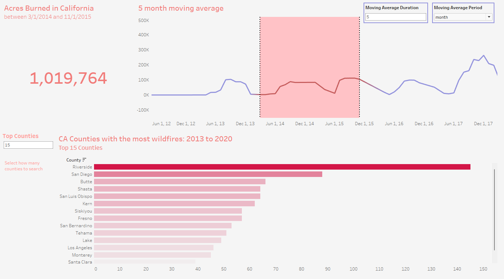

# California Wildfires (2013 - 2020) Dashboard Project

In light of the recent wildfire affecting southern California, I wanted to explore the historical and/or geographical trends of wildfires that have hit California in the past. 



## Dataset:
This dataset was uploaded to Kaggle.com by user Aries, covering all the wildfires California has faced between 2013 and 2020.
- 1600 fires covered (across 59 counties in California)
- You can access the wildfire dataset [here](https://www.kaggle.com/datasets/ananthu017/california-wildfire-incidents-20132020).

## Tools Used: 
- Python (Pandas, Kaggle API): downloading dataset, data cleaning
- Tableau: dashboard, data visualization
    - Total Acres Burned, Moving Average for acres burned, counties with the most wilfire outbreaks

### Note: data has intentionally not been uploaded to github due to large file size. In order to generate the data for yourself:
- clone this repository
- run all the code within ```wildire.ipynb```
